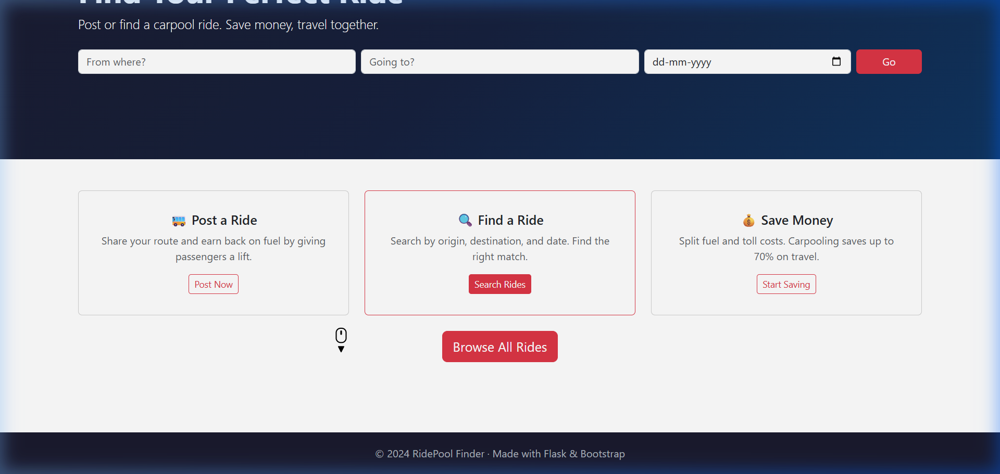
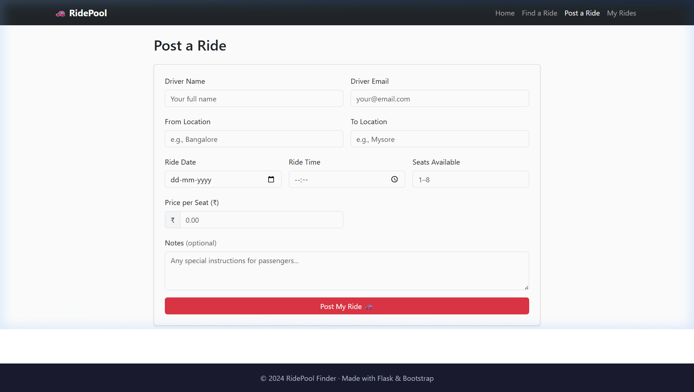
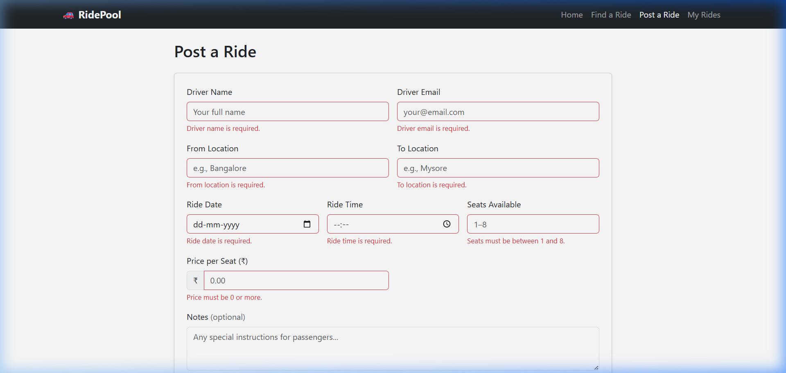
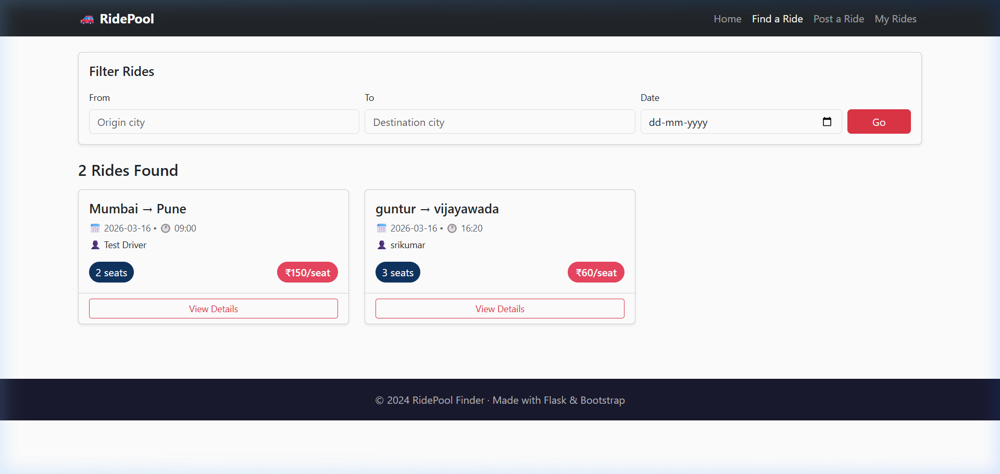
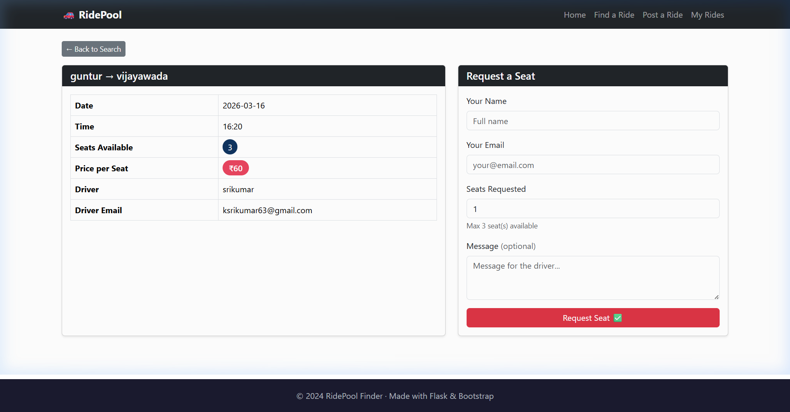
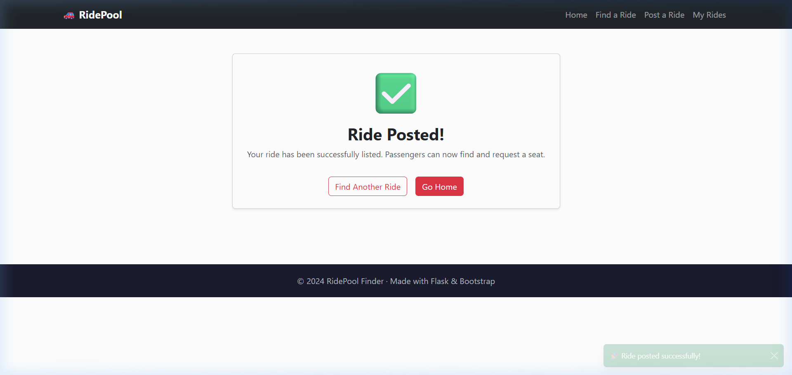
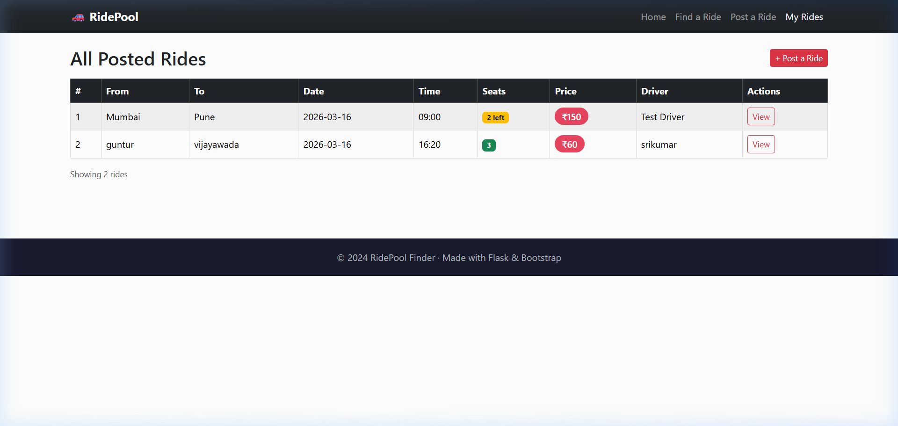

# RidePool Finder 🚗
A full-stack Car Pool Finder web app built with Python/Flask, SQLite, Bootstrap 5, and jQuery. Post available rides or find a ride to join. Share the journey, split the cost.

<div align="center">
  
  
  
  
  
</div>


## Project Structure
```text
/
├── app.py                     # Main Flask routing & SQLite logic
├── schema.sql                 # Database schema (rides + requests tables)
├── requirements.txt           # Pip dependencies
├── ridepool.db                # SQLite database (auto-created on first run)
├── static/
│   ├── css/style.css          # Custom CSS — hero, badges, hover effects
│   └── js/main.js             # jQuery validation, seat warning, toast, nav
└── templates/
    ├── base.html              # Base template — navbar, flash messages, footer
    ├── index.html             # Home page — hero section & search form
    ├── post_ride.html         # Post a ride form
    ├── search_rides.html      # Search results with Bootstrap card grid
    ├── ride_detail.html       # Ride details + seat request form
    ├── request_success.html   # Success confirmation + Bootstrap toast
    └── my_rides.html          # All posted rides table
```

## Local Setup

**1. Clone the repository**
```bash
git clone https://github.com/Madhu-0007/fsd-project.git
cd fsd-project
```

**2. Create a Virtual Environment (Optional but recommended)**
```bash
python -m venv venv
venv\Scripts\activate   # On Windows
# source venv/bin/activate  # On macOS/Linux
```

**3. Install Dependencies**
```bash
pip install -r requirements.txt
```

**4. Boot the Application**
```bash
python app.py
```
*The SQLite database is created automatically on first run. Head over to http://127.0.0.1:5000 to start!*

## Features & Demo

### 1. Home Page — Hero Section & Quick Search
The landing page features a full-width dark gradient hero section with heading **"Find Your Perfect Ride"**. An inline search form lets users instantly filter rides by From location, To location, and Date — all submitted as GET params to the search page. Below the hero, three Bootstrap cards explain the app: **Post a Ride**, **Find a Ride**, and **Save Money**, each with a direct action button.
<br>


### 2. Post a Ride (`/post-ride`)
Drivers fill a Bootstrap card form with all ride details: Driver Name, Email, From/To locations, Date, Time, Seats Available (1–8), Price per Seat (₹), and optional Notes. On submission, the ride is inserted into the SQLite `rides` table. Server-side validation catches any invalid data and flashes error messages.
<br>


### 3. jQuery Client-Side Form Validation
Before the form is submitted to the server, jQuery intercepts the submit event and validates every field inline — no page reload. Checks include: empty fields, valid email format (regex), From ≠ To, date must be today or future, seats between 1–8, price ≥ 0. Red bordered inputs and error messages appear instantly under each invalid field.
<br>


### 4. Search & Filter Rides (`/search`)
The search page renders available rides as a responsive Bootstrap card grid (1 → 2 → 3 columns). Each card shows the route (From → To), date, time, driver name, a coloured seat badge, and a red price badge. A **Filter Rides** panel at the top lets users narrow by origin, destination, and date. When a date is picked the filter form **auto-submits** via jQuery `change` event for an instant UX.
<br>


### 5. Ride Detail & Seat Request (`/ride/<id>`)
Clicking "View Details" opens a two-column page. The left column shows all ride info in a Bootstrap table (route, date, time, seats, price, driver name and email, notes). The right column has the **Request a Seat** form with name, email, seats requested, and an optional message to the driver. jQuery validates the request form and shows a spinner on the submit button while submitting. If seats are ≤ 2, a yellow warning alert appears automatically on page load.
<br>


### 6. Success Page & Bootstrap Toast (`/success`)
After posting a ride or submitting a seat request, the user lands on a centered success card with a large ✅ icon and a contextual message. A **Bootstrap Toast** notification slides up from the bottom-right corner and auto-dismisses after 4 seconds. Two action buttons let the user find another ride or return home.
<br>


### 7. My Rides — All Posted Rides Table (`/my-rides`)
A full Bootstrap `table-hover table-striped` listing every ride in the database. Columns: `#`, `From`, `To`, `Date`, `Time`, `Seats`, `Price`, `Driver`, `Actions`. The Seats column uses colour-coded Bootstrap badges: 🟢 green (3+), 🟡 yellow (1–2 left), 🔴 red (Fully Booked). A **View** action button on each row links directly to that ride's detail page.
<br>


## 🌐 Live Demo

**[https://fsd-project-7otr.onrender.com](https://fsd-project-7otr.onrender.com)**

> Deployed on Render (free tier — may take ~30 seconds to wake up on first visit)